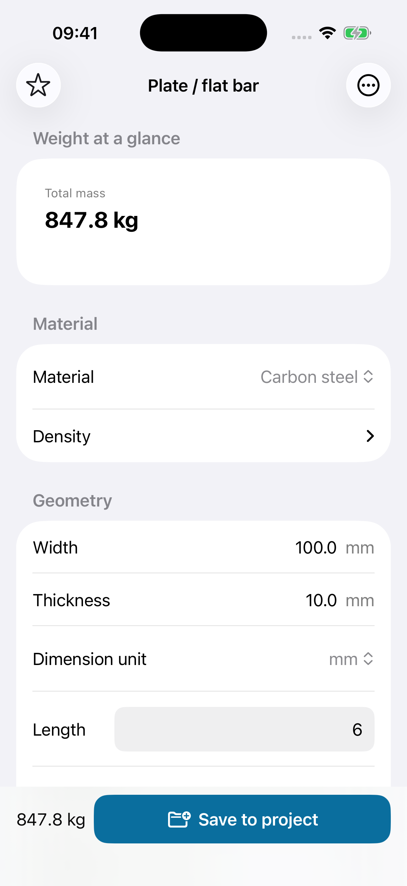
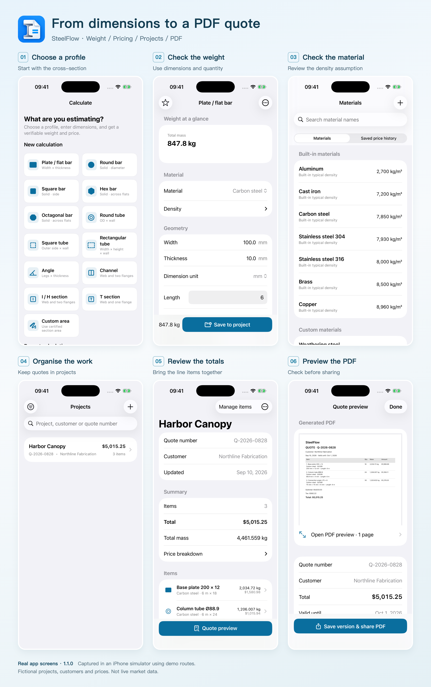
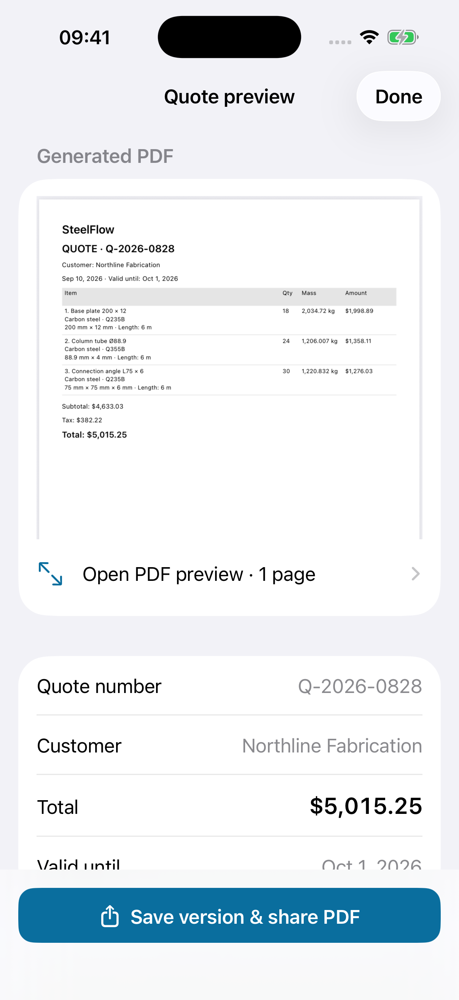

# How to Compare Steel Prices per kg, per Metre and per Piece

One supplier quotes **$0.74 per kg**. Another offers **$5.90 per metre**. A third asks **$35.00 for a six-metre length**.

Which is cheaper?

For the flat bar in the example below, the first and third offers are almost identical. A small difference in delivery or cutting charges could easily change the result. The useful comparison is the cost of the same material, in the same quantity, delivered to the same scope.

Here is a worked example you can check with a calculator or spreadsheet, followed by a checklist for turning the result into a clear material quote.

> Disclosure: I develop SteelFlow, the iPhone app shown in this article. The method works without the app. All prices and supplier offers below are fictional examples in USD, not current market prices.

## Start with an identical material specification

Before comparing prices, make sure all three offers cover the same grade, dimensions, length, quantity and finish. A cheaper price for a different grade or thickness is a different offer.

For this example, assume all suppliers have confirmed the same required carbon-steel grade and finish:

- Flat bar: **100 mm wide × 10 mm thick**
- Length: **6 metres per piece**
- Quantity: **18 pieces**
- Density used for the estimate: **7,850 kg/m³**

The density is an assumption for theoretical mass. The Steel Construction Institute’s section tables also use 7,850 kg/m³ when calculating mass per metre. For an actual order, confirm the relevant product data and whether the supplier bills by theoretical or measured weight. [SCI reference](https://steelconstruction.info.iceblue-digital.co.uk/images/b/b7/SCI_P363.pdf)

## Calculate the weight once

For a rectangular flat bar, volume is width × thickness × length. Convert the dimensions into metres before multiplying by density.

**Weight per metre = 0.100 × 0.010 × 1 × 7,850 = 7.85 kg/m**

**Weight per piece = 7.85 × 6 = 47.10 kg**

**Total weight = 47.10 × 18 = 847.80 kg**

The order therefore contains **108 metres** of bar and has an estimated mass of **847.80 kg**.

*The same calculation in SteelFlow. The full input is 18 pieces, each 6 m long; some input fields are below the visible area of the screen.*

This rectangular formula is useful for flat bar. For tubes, angles and rolled sections, use the appropriate cross-section calculation or the applicable supplier section table. Do not treat a hollow section as a solid bar or assume nominal dimensions capture every rolled corner and fillet.

## Put all three offers on the same basis

Multiply each rate by the quantity it actually prices: kilograms, metres or pieces.

| Fictional offer | Calculation | Material subtotal |
| --- | --- | --- |
| A: $0.74/kg | 847.80 kg × $0.74 | **$627.37** |
| B: $5.90/m | 108 m × $5.90 | **$637.20** |
| C: $35.00 per 6 m piece | 18 pieces × $35.00 | **$630.00** |

Offer A is the lowest material subtotal, but it is only **$2.63 below C**. That is too small a difference to judge the order without checking the other charges.

You can also convert the rates for a quick check:

- Price per metre = price per kg × kg per metre
- Price per piece = price per metre × metres per piece
- Equivalent price per kg = price per piece ÷ kg per piece

At $0.74/kg, this bar costs **$5.809/m**, or **$34.854 per six-metre piece**, before rounding. Keep the extra decimal places during the calculation, then round the line total to currency precision. Rounding every intermediate rate can introduce a small difference across a large order.

If a supplier quotes per foot or pound, convert both the rate and the quantity consistently. Also spell out whether “ton” means a metric tonne of 1,000 kg or a US short ton of 2,000 lb.

## Compare the delivered scope, too

Suppose A adds $60 for delivery, B includes delivery, and C adds $25. Assume the same delivery destination and no other charges in this simplified comparison.

| Offer | Material | Delivery | Total before tax |
| --- | --- | --- | --- |
| A | $627.37 | $60.00 | **$687.37** |
| B | $637.20 | Included | **$637.20** |
| C | $630.00 | $25.00 | **$655.00** |

B now has the lowest total. Its higher price per metre did not make it the most expensive order.

For a real comparison, check cutting, drilling, finishing, packaging, minimum-order charges and unloading requirements where relevant. Record exclusions as well as inclusions. Tax treatment and delivery terms must also be comparable.

Keep material procurement separate from a complete fabrication or installation estimate. Weight alone does not describe weld length, setup time, access, lifting or installation labour.

## Make the waste allowance explicit

A “5% waste allowance” needs a definition. Adding 5% to net theoretical weight would give:

**847.80 × 1.05 = 890.19 kg**

That is a costing allowance; it does not by itself tell you how many stock lengths to buy. A cutting plan may require another whole bar, and some offcuts may be reusable.

It is also different from assuming that 5% of purchased material is lost. Under that definition, required purchase weight would be **847.80 ÷ 0.95 ≈ 892.42 kg**.

Choose the interpretation that matches the job and state it. If you already price the actual stock lengths being purchased, check that an additional waste percentage is not charging for the same offcuts twice.

## Leave a quote someone else can check

A useful material quote should let another person reconstruct the total. Include:

- Material grade, profile, dimensions, finish and length
- Quantity and the unit being counted
- Weight basis: theoretical calculation, section table or measured weight
- Currency, unit price and price basis
- Waste allowance and what it means, if used
- Processing, delivery and other charges, with inclusions and exclusions
- Tax, quote date, validity and delivery terms

A PDF is convenient for sharing, but the detail inside it is what makes the quote useful. When a price changes, keep an identifiable revision so an old attachment does not become the basis of a new order.

## Keeping the calculation and quote together

In SteelFlow, the workflow is to select a profile, enter its dimensions and material, check the calculated weight, then save the item to a project. Pricing and project details can then be carried into a PDF quote preview.

*The workflow at a glance. These are real app screens captured in an iPhone simulator. The Harbor Canopy project is a separate fictional example with three material lines; its totals are not the single-bar comparison above.*

*Inspect the line items and terms before sharing. Example customer names, prices and project details are demonstration data.*

The app uses prices you enter; the examples here do not come from a live steel-price feed. It calculates theoretical weight and helps organise a quote, rather than determining a structural design or reading quantities from construction drawings.

At the time of writing, the free tier supports two active projects with up to ten items each and branded PDF exports. Pro is a one-time purchase that adds features including unlimited projects and items, company details, CSV export and removal of PDF branding. Check the current App Store listing and in-app offer for availability and local pricing.

Next time you receive a material quote, put the specification, quantity, price basis and delivered scope side by side before comparing totals. That small comparison is useful whether you work on paper, in Excel or on your phone.

If you would like to try the workflow shown here, [download **SteelFlow: Metal Calculator** on the App Store (US listing)](https://apps.apple.com/us/app/steelflow-metal-calculator/id6806282417).

If the link does not open the app page, open the App Store and search for **SteelFlow: Metal Calculator**. In the China mainland store, the app is listed as **SteelFlow 钢材重量计算器** ([China mainland listing](https://apps.apple.com/cn/app/steelflow-钢材重量计算器/id6806282417)).
