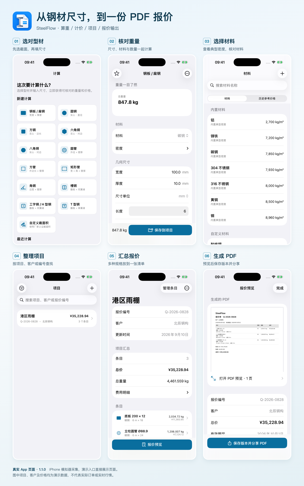
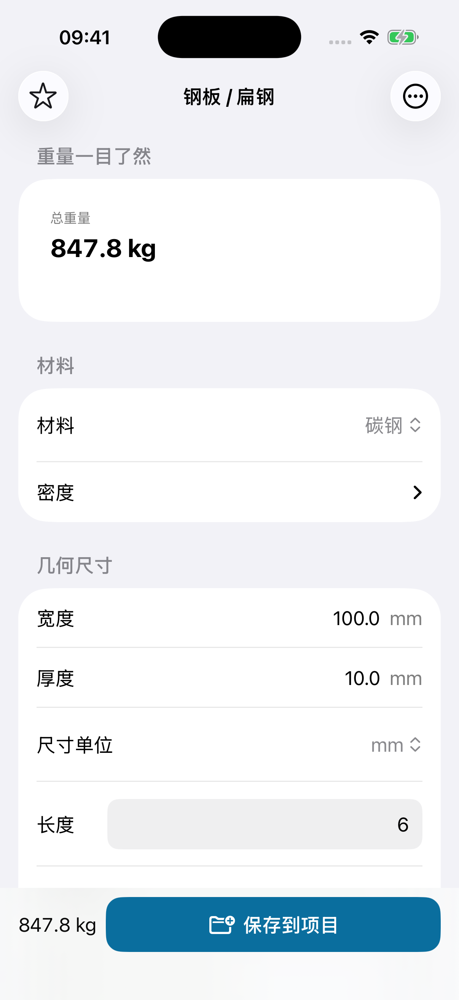
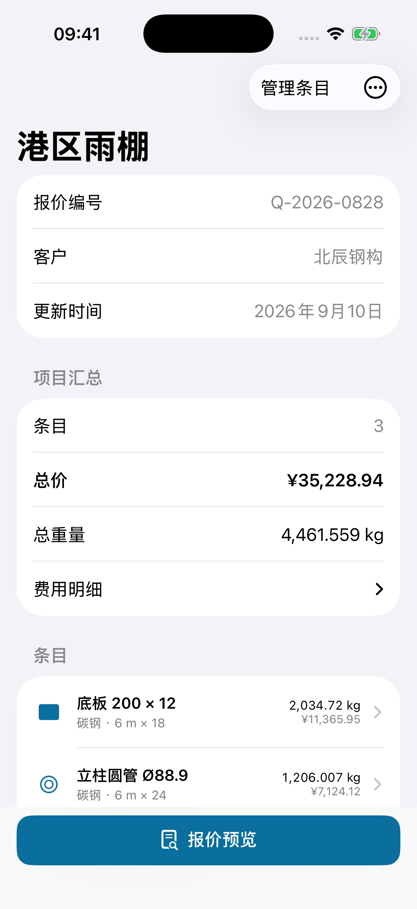
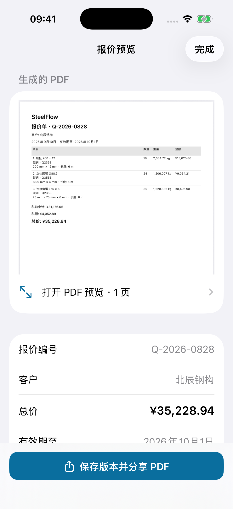
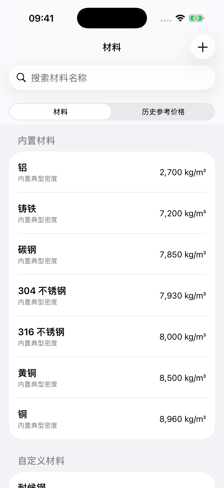

# 钢材重量怎么算、报价单怎么做？用 SteelFlow 从尺寸算到 PDF

一张材料清单到了手上：钢板多厚、圆管多长、各要多少件。客户接着问：“这些一共多重？算上加工和运输，多少钱？”

**重量只是第一步。** 接下来还要核对计价单位、把不同规格放到一起，再整理成一份对方看得懂的报价单。

SteelFlow 是一款面向 iPhone 和 iPad 的钢材与金属计算 App。输入截面尺寸、长度、数量和材料密度，就能计算理论重量；需要报价时，可以把条目存入项目，计入费用，再生成 PDF。下面用实际界面走一遍。

> 本文由 SteelFlow 产品方整理，基于已上架的 1.1.0 版本。配图来自实际运行的 App，采用演示数据，不是真实客户订单；示例单价不代表当前钢材行情。

*一眼看懂：从选择型材，到项目汇总和 PDF 报价。拼接图可打开看大图，后文也有单页截图。*

## 先算一组钢板：100 × 10 mm，6 米长，18 件

钢板或扁钢的理论重量，可以按“体积 × 密度”计算。先把单位统一成米，再乘数量，就不会把毫米尺寸直接当成米使用。

这组练习输入如下：

- 材料：碳钢，采用示例密度 7,850 kg/m³。
- 宽度：100 mm，也就是 0.1 m。
- 厚度：10 mm，也就是 0.01 m。
- 长度：每件 6 m；数量：18 件。

单件重量为 **0.1 × 0.01 × 6 × 7,850 = 47.1 kg**，18 件合计 **847.8 kg**。这就是下图里的总重量；它还没有把损耗加进来。

打开“计算”，选择“钢板 / 扁钢”，按上面的参数输入即可。改数量或尺寸时，重量会跟着更新，方便先核对输入，再考虑价格。

*真实计算页：长度和数量位于尺寸表单中，向下滚动可继续查看。上方直接给出重量结果。*

圆钢、方钢、圆管、矩形管等也有对应入口。关键是选对截面：例如圆管需要外径和壁厚，不能用实心圆钢的直径代替。

## 算出重量以后，怎样变成材料成本？

如果供应商按公斤报价，就用重量与每公斤单价核算。如果供应商报的是每米或每件，先选择对应计价方式，不能把“元/米”直接填进“元/kg”。SteelFlow 支持按 kg、lb、米、英尺或件计价。

仍用前面的 847.8 kg 举例：假设示例单价为 5.32 元/kg，不计损耗和其他费用，材料金额是 **847.8 × 5.32 = 4,510.30 元**，按人民币金额舍入。

如果还要考虑损耗，或加上加工费、运输等费用，可以展开“计价”继续填写。计价默认折叠，所以只是临时查重量时，不必先面对一长串报价字段。

**材料金额不等于最终报价。** 整理项目时，还要核对费用、加价或毛利设置及税费。本文的 5.32 元只是演示输入；实际使用应填写供应商给你的价格，并记录适用材料、规格与日期。

## 多种规格放到一个项目里，比只留一张计算截图更好核对

一份实际清单通常不止一种材料。每次算完，点“保存到项目”，把规格留在同一项目里，之后就能一起查看条目、重量和报价。

下图换用一份独立的“港区雨棚”演示项目。**它不是前面 100 × 10 mm 的练习单**，而是由三种材料组成：

- 底板：200 × 12 mm，每件 6 m，共 18 件。
- 圆管：外径 88.9 mm、壁厚 4 mm，每件 6 m，共 24 件。
- 角钢：75 × 75 × 6 mm，每件 6 m，共 30 件。

项目页面把这三行汇总为 **4,461.559 kg**。示例预设的单价、损耗、加工等费用和项目定价共同形成 **35,228.94 元**的报价；这个金额是演示结果，不是这几种材料的市场参考价。

*项目总览保留条目入口，并提供“费用明细”。要解释报价，先核对组成，不只看最后一个总价。*

客户修改数量时，回到对应条目调整即可。项目列表还能按项目、客户或报价编号搜索，方便找到之前的记录。

## 给客户看的，最后是一份 PDF 报价单

条目与费用确认后，在项目页点“报价预览”。SteelFlow 会生成 PDF，展示报价编号、客户、规格、数量、重量和金额等信息。

下图还是同一份“港区雨棚”项目：预览里的总价与项目页一致。检查完成后，点底部的 **“保存版本并分享 PDF”**，即可通过系统分享面板保存文件或发送给客户。

*真实导出预览。项目总价与 PDF 总价均为 35,228.94 元；示例 PDF 保留免费版品牌标识。*

保存报价版本的意义，是把“这次发出去的内容”留下来。后来项目有变化，之前保存的版本仍可用来回看，避免只剩下一份不断被覆盖的报价。

你也可以直接打开这份 [App 生成的示例 PDF](assets/sample-quote.pdf)，看看文件本身的排版。它使用虚构项目和客户名称，仅用于演示。

## 不锈钢、铝和铜，能不能一起算？

可以。材料页提供不同材料的典型密度，计算时应选择实际使用的材料。相同体积换成不同密度，重量自然会不同，不能一律沿用碳钢密度。

*内置的是典型密度。遇到具体牌号或特殊材料，应核对供应商资料；自定义材料属于 Pro 功能。*

如果你已有成熟的 Excel 成本表，也可以继续用它。SteelFlow 更适合在手机上做尺寸算重、轻量项目汇总和报价输出；Pro 提供 CSV 导出，便于把材料清单交给表格软件继续处理。

## 免费版能做到哪一步？

可以先用免费版完成快速算重、基础项目管理，并生成带 SteelFlow 品牌标识的 PDF。1.1.0 的免费限制是 **2 个活跃项目，每个项目最多 10 个条目**。

Pro 是一次性非消耗型购买，不是订阅，扩展无限项目与条目、自定义材料、公司资料与报价条款、CSV 导出、无品牌标识 PDF、备份与批量定价等功能。购买金额以你所在地区 App 内显示为准。

如果你只是偶尔核对一组钢板或钢管，先把免费计算用起来；需要持续整理项目和对外报价时，再看是否需要这些扩展。

## 开始前，还有三个容易混淆的问题

**理论重量能直接当成过磅重量吗？**

不能。这里计算的是几何尺寸与密度对应的理论值，不是称重记录。实际材料有尺寸和密度差异，结算应核对双方约定的计重方式。行业资料也明确区分理计价与过磅价，可参考 [Mysteel 钢材价格指数方法论](https://a.mysteelcdn.com/common/mysteel/dataIndex/pdf/methods/gangcai.pdf)。

**能自动获取今天的钢价吗？**

本文介绍的是你输入价格后进行核算的流程。历史参考价格是保存在本机的记录，不会自动变成最新行情。

**能读图自动算料、做排样或结构设计吗？**

这些不是本文演示的功能。SteelFlow 用于理论算重与报价整理，不能把结果当作结构承载能力或加工方案的确认。

## 从手头的一条规格开始

拿一条你熟悉的规格，在 SteelFlow 输入材料、尺寸、长度和数量，先把重量核对上。然后保存到项目，加上真实单价，预览一次 PDF，就能判断它是否适合你的日常工作。

[在 App Store 下载 SteelFlow](https://apps.apple.com/cn/app/id6806282417) · [产品介绍](https://docs.puzzles-game.com/zh/steelflow) · [使用支持](https://docs.puzzles-game.com/zh/steelflow/support)
