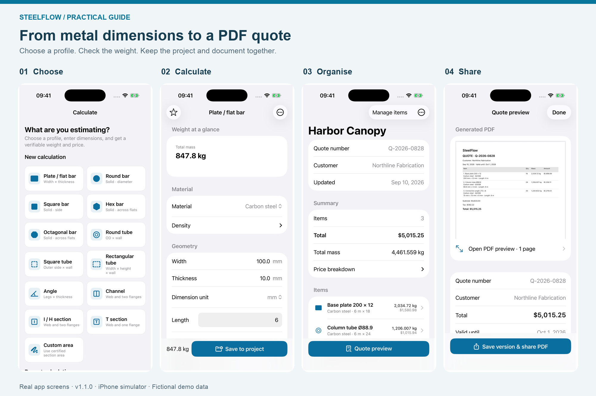
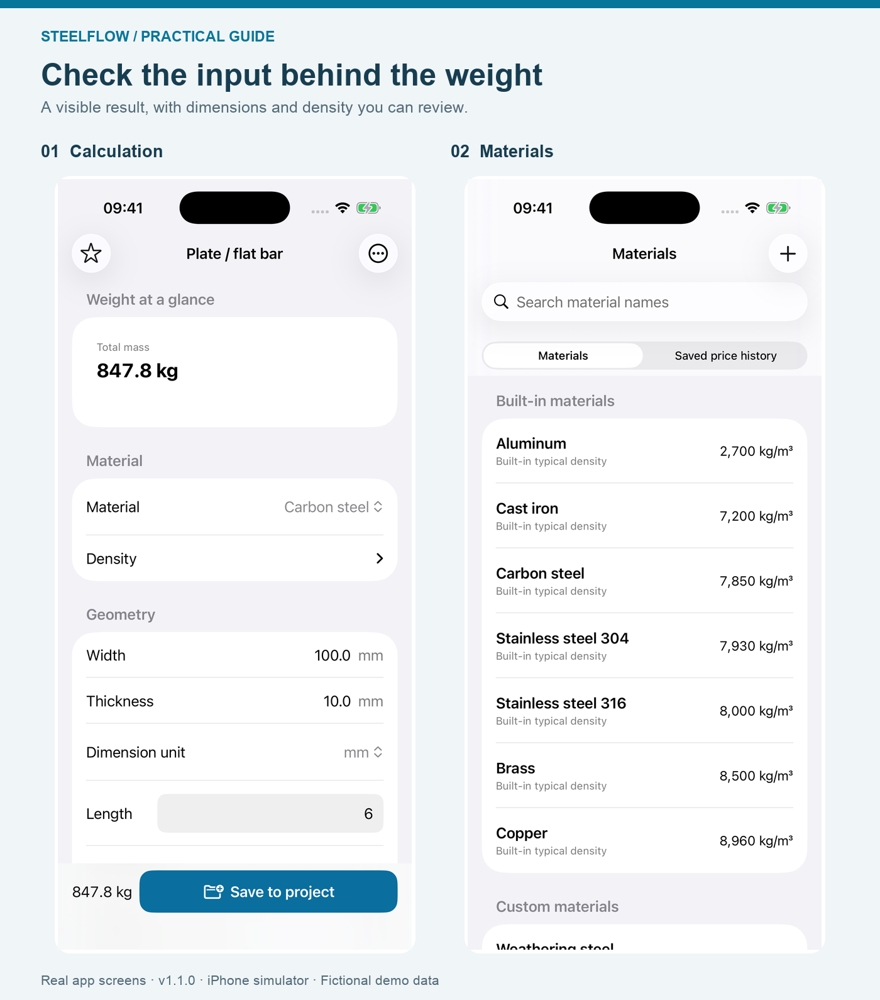
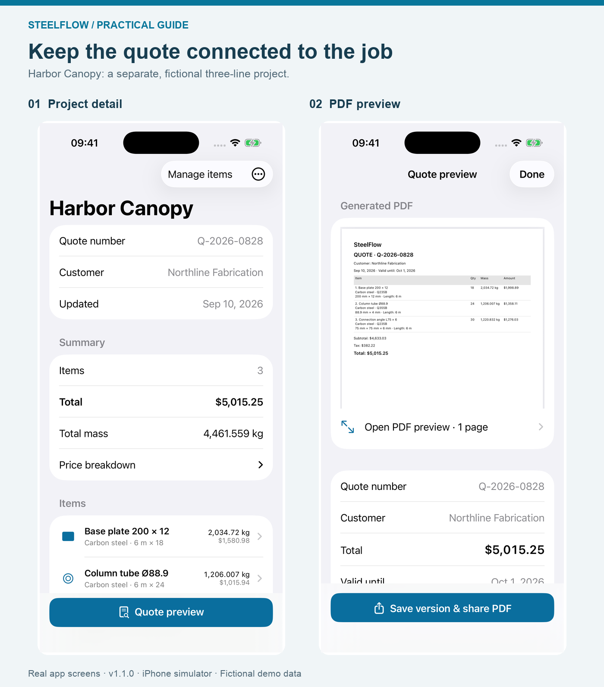

# A Metal Weight Calculator That Keeps the PDF Quote Connected

A metal weight calculator answers one question: how heavy is this order? A useful material quote has to preserve the specification, price basis and customer details as well. This guide shows how to keep those pieces together on an iPhone, using SteelFlow’s calculation, project and PDF features.

*Disclosure: I develop SteelFlow. This article was written with AI assistance and checked against the app, its source and its current App Store listing. Screenshots are real English app views captured in an iPhone simulator; customer names and prices are fictional demonstration data.*

*Four connected stages: choose the shape, check the quantity, organise the order and review the document. The flat-bar calculation and Harbor Canopy project are separate examples.*

## Choose a shape before entering numbers

SteelFlow starts with profiles: plate and flat bar, solid bars, tubes, angles and other sections. Choosing the cross-section determines which dimensions the calculation needs. A round tube needs its outside diameter and wall thickness; a solid round bar needs its diameter.

This is useful when a material list contains different shapes. You do not have to make one spreadsheet row pretend that every item is a rectangular solid.

There is still a check to make before typing: confirm whether the dimension on the supplier’s specification is an outside size, wall thickness or another measurement. A correctly entered number in the wrong field produces a convincing but unhelpful result. For rolled sections, check the applicable supplier section data rather than assuming nominal geometry reproduces every corner and fillet.

## Keep the material and the quantity visible

The calculation screen brings the material, dimensions and result together. SteelFlow also has a material catalogue, so density is part of the input rather than an unexplained constant buried in a formula.

For a simple check, the screenshot below uses carbon-steel flat bar: **100 mm wide, 10 mm thick, 6 m long, 18 pieces**, with a density of **7,850 kg/m³**. Converting the dimensions to metres gives:

**0.100 × 0.010 × 6 × 18 × 7,850 = 847.8 kg**

The same order is **108 metres** in total. Keep that quantity available if your supplier prices by length. The [Steel Construction Institute’s section tables](https://steelconstruction.info.iceblue-digital.co.uk/images/b/b7/SCI_P363.pdf) also use 7,850 kg/m³ for steel section mass calculations; the density for your actual material still needs checking.

*The calculation is a theoretical weight estimate. The piece-count field is below the visible portion of this capture; the complete input is stated above.*

The practical feature is not simply a large total. It is being able to return to the inputs that produced it. If a customer changes the thickness or the number of pieces, update the relevant input and check the result again.

## Open pricing when you are ready to quote

Sometimes you only need a weight. Sometimes you are preparing an order. SteelFlow’s pricing settings start collapsed, so the initial calculation does not require working through a long quotation form.

When you need a cost, expand pricing and enter the rate on the correct basis. A price per kilogram, per metre and per piece are different inputs. The app uses the prices you supply; it does not fetch live steel-market prices.

For this flat-bar example, a fictional **$0.74/kg** rate gives a material subtotal of **$627.37**, before additional charges. Record the scope of any delivery or processing charge as well. A material subtotal is not automatically the total cost of fabrication and installation.

The earlier guide, [comparing steel prices per kg, metre and piece](https://medium.com/@xuezaigds/how-to-compare-steel-prices-per-kg-per-metre-and-per-piece-de2982e3d2de), covers the rate conversion in more detail.

## Save the calculation as an item in a project

A single result is easy to lose among screenshots and messages. In SteelFlow, you can save the calculated item into a project, then review the order as a set of line items with a total weight and price.

Use a project name that identifies the job, and check the customer and quote number before sharing. Search in the project list helps you find an existing job by project, customer or quote number instead of starting another copy.

The Harbor Canopy screens below show a **separate three-line demonstration project**. Its total is **4,461.559 kg** and **$5,015.25**; those figures do not belong to the flat-bar example above.

*Review the project first, then inspect the generated document. Both screens come from the same fictional Harbor Canopy project.*

This is where a project-based calculator earns its place: the customer-facing document can stay connected to the quantities you checked, rather than becoming a separately typed total.

## Preview the PDF before sharing a version

The PDF preview lets you inspect the generated quote before opening the share flow. The app’s “Save version & share PDF” action also makes the distinction between a working project and a quote you have issued explicit.

Before sending any material quotation, use this checklist. It works just as well for a spreadsheet or a paper estimate:

- **Specification:** profile, material or grade, dimensions and finish are unambiguous.
- **Quantity:** length per piece and number of pieces are both correct.
- **Price:** currency and the unit being priced are clear.
- **Scope:** delivery, processing and exclusions are stated where relevant.
- **Identity:** the customer, quote number and validity date match the intended order.
- **Revision:** you can distinguish this document from an earlier attachment.

The PDF is the handoff, not a substitute for checking the inputs. If a supplier changes a rate after you have shared a quote, review the changed project and issue an identifiable new version.

## Use the phone for the job it suits

SteelFlow works offline and does not require an account for its core workflow. That makes it a practical option for checking known dimensions and preparing a material quote without first setting up a cloud estimating system.

It is not a drawing takeoff tool, a structural-design calculation or a complete workshop labour model. If the task is measuring a large drawing set, planning cuts across stock lengths or estimating welding and installation time, those steps need their own tools and review.

The free tier supports two active projects with up to ten items each and branded PDF exports. The one-time Pro purchase adds features including unlimited projects and items, company details, CSV export and removal of PDF branding. CSV is useful when the next step is a spreadsheet rather than a customer attachment; check the in-app offer for current regional pricing and terms.

Start with one familiar material line. Verify its quantity independently, save it to a project, and inspect the PDF. That small trial tells you more about whether the workflow fits your work than entering a whole job immediately.

The app’s full English name is **SteelFlow: Metal Calculator** — [open its App Store page](https://apps.apple.com/us/app/steelflow-metal-calculator/id6806282417). If the link does not open the detail page, search that exact name in the App Store. In mainland China, search **SteelFlow 钢材重量计算器** or use the [China mainland listing](https://apps.apple.com/cn/app/steelflow-钢材重量计算器/id6806282417).
