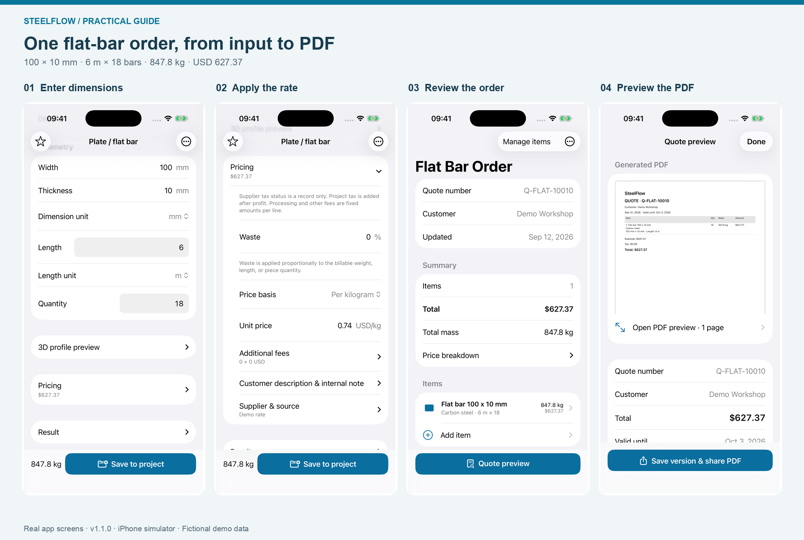
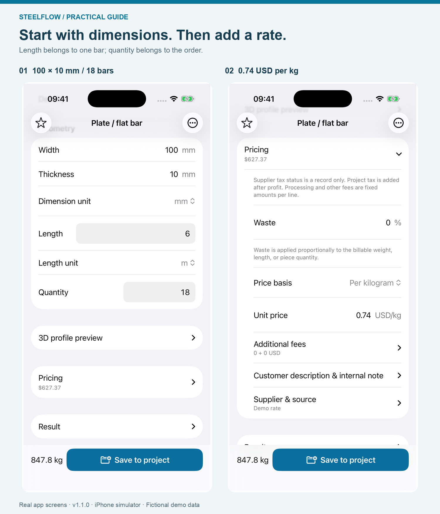
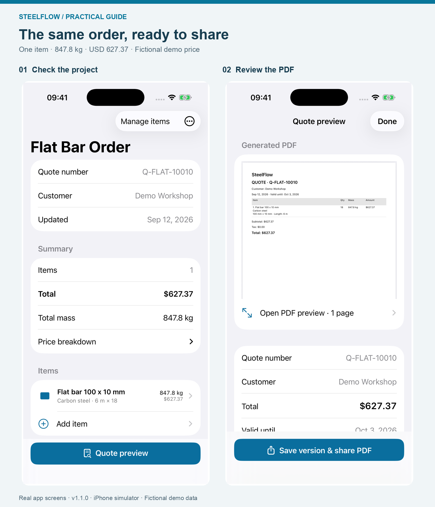
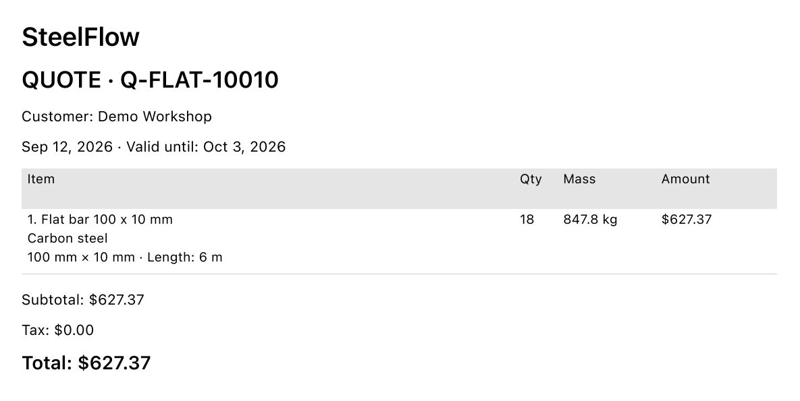

# Flat Bar Weight Calculator: From 100 × 10 mm Steel to a PDF Quote

A worked iPhone example: 18 six-metre bars, a checkable weight calculation, and a one-line material quote.

A weight result is only part of a useful material quote. Someone reading the quote also needs to know which dimensions you used, how many pieces it covers, and what the price is based on. This walkthrough keeps one flat-bar order together from the first input to the final PDF.

I'm the developer of SteelFlow: Metal Calculator. This guide was written with AI assistance and checked against the app's calculation and PDF output. All screenshots use fictional demo data; the price is an example, not a current supplier offer.

*The same order at four stages. Actual SteelFlow 1.1.0 screens captured in the iOS simulator; demo values are used throughout.*

## The order we are calculating

We'll use carbon-steel flat bar with these inputs:

- Width: **100 mm**
- Thickness: **10 mm**
- Length of each bar: **6 m**
- Quantity: **18 bars**
- Density: **7,850 kg/m³**
- Example material rate: **USD 0.74 per kg**

For this first quote, waste allowance, processing fees, other fees, markup and tax are all zero. That makes it possible to follow the material amount directly from the weight calculation. A real quote should use the allowances, charges and tax treatment appropriate to that order.

## 1. Choose Plate / Flat Bar and enter the dimensions

In SteelFlow's Calculate tab, choose **Plate / Flat Bar**. Select **Carbon steel**, then check the density. This example uses 7,850 kg/m³; use a suitable density when calculating a different material.

Enter **100** for width and **10** for thickness, with the dimension unit set to **mm**. Enter **6** for the length, choose **m**, and set the quantity to **18**.

The length belongs to one piece. Do not enter the order's combined 108 metres as the length and also set the quantity to 18—that would count the quantity twice.

*Dimensions and quantity describe the material. Pricing is a separate, expandable section.*

## 2. Check the weight before entering a price

For a rectangular flat bar, cross-sectional area is width multiplied by thickness. Convert the millimetres to metres before multiplying by density:

**0.100 m × 0.010 m = 0.001 m²**

Multiply that area by one metre of length and by the density:

**0.001 m² × 1 m × 7,850 kg/m³ = 7.85 kg per metre**

One six-metre bar therefore weighs:

**7.85 × 6 = 47.1 kg**

And the complete order weighs:

**47.1 × 18 = 847.8 kg**

A useful shortcut for this density is:

**Flat-bar kg/m = width in mm × thickness in mm × 0.00785**

That shortcut gives the weight of one metre, not one piece or the whole order. [Parkside Steel's calculator](https://parksidesteel.co.uk/tools/steel-weight-calculator) also explains the area-and-density method for flat bar and distinguishes per-metre weight from total order weight.

These are theoretical weights based on nominal dimensions and density. Actual supplied weight can differ because of dimensional tolerances and material variation. Check the supplier's basis when using the result for purchasing.

## 3. Expand Pricing and enter the rate with its unit

Tap **Pricing** to expand it. Set the price basis to **per kilogram** and enter **0.74 USD/kg**. Leave waste at **0%** and additional fees at **0** for this example.

The material amount is:

**847.8 kg × USD 0.74/kg = USD 627.372**

Rounded to two decimal places, the quote is **USD 627.37**.

The unit beside the rate matters. USD 0.74 per metre would describe a different offer from USD 0.74 per kilogram. SteelFlow lets you choose the pricing basis; the rate still comes from you, not a live market-price feed.

If you add a waste allowance or fees later, check the updated total before saving. The extra amount needs an explanation beyond the theoretical net weight.

## 4. Save the calculation to a project

Tap **Save to project** and choose a project, or create one from the save sheet. For this example, use **Flat Bar Order**.

The project shown here has quote number **Q-FLAT-10010** and customer **Demo Workshop**. Its only item is the 100 × 10 mm flat bar. With no project markup or tax, the project should show **1 item**, **847.8 kg** and **USD 627.37**.

Check those three values before moving on. An unexpected total can come from an extra item, a changed quantity, a fee or a project pricing setting. Returning to the inputs is more useful than correcting the total by hand in a separate document.

*Project Q-FLAT-10010 contains one line. The quote preview uses the same order and total.*

## 5. Preview the PDF, then save a version and share

Open **Quote preview** from the project. Review the document itself: customer, quote number, flat-bar specification, quantity, weight and final amount.

For this example, the PDF should identify **18 pieces**, **847.8 kg** and **USD 627.37**. The footer reminds the reader to verify specifications before ordering or fabrication.

*A cropped detail of the actual app-generated PDF. The original full-page file includes the SteelFlow branding and verification reminder in its footer.*

When the document is ready, use **Save version & share PDF**. Saving the version preserves the quotation's values at that point; the share sheet lets you choose a destination such as Files or an email app.

If the supplier changes the rate, update the item, review the project again and create a new quote version. That keeps the sent quotation separate from your next revision.

## What this workflow covers

This is a material-weight and quotation workflow for known dimensions. It does not calculate the structural capacity of the flat bar, extract quantities from drawings, or determine fabrication labour. Those require their own inputs and checks.

You can reproduce the example in the free version: it allows two active projects, up to ten items per project and branded PDF export. The optional one-time Pro purchase adds unlimited projects and items, company details, CSV export and removal of PDF branding; it is not required for the one-line PDF shown here.

To try the same order, download **[SteelFlow: Metal Calculator](https://apps.apple.com/us/app/steelflow-metal-calculator/id6806282417)** for iPhone or iPad. That is the full English App Store name to search if the link does not open in your storefront. In mainland China, search **SteelFlow 钢材重量计算器** or use the [China App Store listing](https://apps.apple.com/cn/app/steelflow-%E9%92%A2%E6%9D%90%E9%87%8D%E9%87%8F%E8%AE%A1%E7%AE%97%E5%99%A8/id6806282417).

Start by checking **7.85 kg/m**, then **847.8 kg for the order**, and finally **USD 627.37 on the PDF**. Those three checkpoints connect the dimensions to the document you send.
